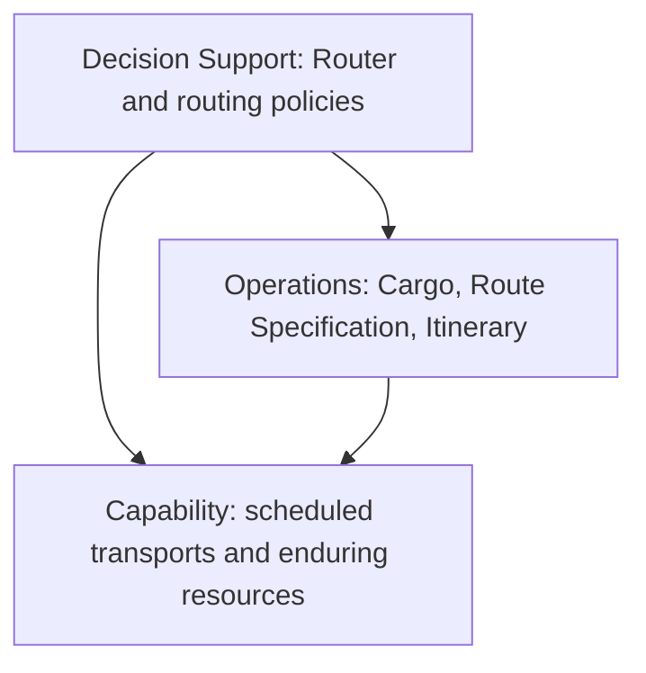

# Chapter 16: Large-Scale Structure

Source: supplied PDF, pages 272-300. The structures here organize domain design; they are distinct from the technical Layered Architecture in Chapter 4.

## Core Idea

A large model may need an organizing language that explains each part's place in the whole. Adopt a small set of useful roles, relationships, or rules when it clarifies the system, and let that structure evolve through implementation experience.

Modules divide detail; Bounded Contexts protect meaning; distillation identifies value. None necessarily explains how a large collection of parts fits together. Large-scale structure supplies that broader explanation. It is optional: an ill-fitting structure is worse than none.

## Evolving Order

Use Evolving Order to gain consistency without freezing early assumptions.

1. Identify a real comprehension or coordination problem in the growing design.
2. Propose a minimal organizing principle grounded in domain knowledge.
3. Apply it to representative parts through refactoring, refining both the design and the rule.
4. Communicate its terminology and expectations throughout the affected teams.
5. Mark justified exceptions explicitly.
6. Modify or discard the structure when exceptions and awkward choices become frequent.

A structure should help independent developers make compatible decisions while leaving detailed design to people with local knowledge. Do not create an elaborate framework merely to enforce every conceptual rule. Account for external systems whose internals the team cannot change.

### Worked example: A communications simulator

The simulator already has coherent Modules, but there are too many to locate behavior or place new concepts confidently. The team discovers a story about physical transmission, packet routing, and other conceptual levels. They refactor Modules and object responsibilities so each fits its chosen level, while refining the levels from hands-on experience.

The structure is not necessarily a class or package of its own. It is an organizing set of rules that makes the responsibilities and relationships of many artifacts predictable.

## System Metaphor

Adopt a concrete analogy only when it captures the team's imagination, helps explain the whole, and guides useful design choices. Add it to the Ubiquitous Language and continually check for misleading implications.

The firewall metaphor makes a boundary and protective role easy to understand, but also risks overlooking threats originating inside it or the need for selective exchange. This is a conceptual example, not current security guidance.

A metaphor can span several contexts because each can map to it approximately. That flexibility is also its weakness: the analogy may be vague or seductive rather than useful. Do not force a metaphor onto every project or call an ordinary domain model a naive metaphor. A refined shared language can do the needed work without an additional analogy.

## Responsibility Layers

Use this structure when the domain has natural strata with clear conceptual dependencies and different rates or causes of change.

1. Identify broad responsibilities that tell the system's domain story.
2. Place concepts that make sense independently below concepts that depend on them.
3. Refactor objects, Aggregates, and Modules to fit one responsibility layer each where the structure applies.
4. Permit an upper layer to use any lower layer: Evans uses relaxed layering, not only adjacent-layer calls.
5. Keep lower layers conceptually independent of higher ones.
6. Reconsider the structure if it repeatedly distorts useful domain relationships.

Simply drawing existing package dependencies vertically is not enough. Layer names must explain the business model and guide future decisions.

### Worked example: Shipping responsibilities



This is a reconstructed conceptual dependency diagram, not a reproduction of a source figure. Arrows mean may depend on; they do not specify network calls or message flow.

- **Capability/Potential:** resources available for operations. Scheduled Transit Legs belong here for users coordinating cargo delivery.
- **Operations:** actual, historical, and planned business activity. Cargo and its delivery requirements and plan belong here.
- **Decision Support:** analysis and selection of actions. Router belongs here because it helps choose a plan.

The same Transit Leg might be operational in software for running the fleet itself. An enduring Customer relationship is a capability in the chapter's business; a transient customer could be an operational concern elsewhere. Layer placement expresses the purpose of this model, not a universal classification.

Because Capability must not depend on Operations, a Customer-to-Cargo back-reference is replaced by a Cargo Repository query. Cargo can still reference Customer. The query retrieves operations for a capability without giving the lower-level object an upward responsibility.

An `isPreferred` flag on a Transport Leg initially mixes resource facts with a routing decision. Extracting a Route Bias Policy into Decision Support makes both meanings clearer.

### Adding a routing restriction

For hazardous-material route restrictions, it is tempting to let Cargo obtain a policy and incorporate it into its own Route Specification. That makes an Operations object depend on Decision Support. Within the selected structure, Router instead gathers applicable policies and the information they require.

Both designs have local tradeoffs; the structured choice earns its value from consistency across the larger model. The example is about responsibility placement, not an operational specification of hazardous-material regulations.

### Candidate layers and their questions

| Responsibility | Question | Distinction |
|---|---|---|
| Potential/Capability | What can we do? | Available resources and arrangements independent of a particular operation |
| Operations | What are we doing or have we done? | Real activity and active plans |
| Decision Support | What action or policy should we choose? | Analysis based on underlying facts and capabilities |
| Policy | What rules and goals apply? | Constraints and intentions governing decisions and actions |
| Commitment | What have we promised? | Obligations formed through business activity that direct future work |

These are examples, not a required five-layer stack. Different domains may merge or replace them. Evans cautions that more than roughly four or five layers becomes difficult to explain. The governing test is whether the structure tells a concise, useful story.

A responsibility layer may cross contexts or reside within one. Using a rules engine does not inherently make Policy a separate context; a consistent common model may be crucial to its effective use.

## Knowledge Level

Use this selectively when users must configure how operational objects are allowed to relate and behave, under stable higher-order domain constraints.

Create ordinary domain objects that describe and constrain other domain objects. Separate configurable policy/type knowledge from everyday operational instances. This is domain-level reflection, not a recommendation to use programming-language reflection APIs.

### Worked example: Payroll and pension

An initial model couples hourly versus salaried employees to particular retirement arrangements. A policy change requires hourly office administrators to use the defined-benefit plan.

Removing constraints would allow any employee to select any plan, which fails the company's rule. Employee Type instead determines the permitted arrangement. Authorized policy editors change types; personnel staff assign individual Employees to types and edit ordinary employee information.

Recognizing a Knowledge Level exposes another missing concept: Payroll was still mixed into Employee Type. Factoring Payroll separately permits the useful statement that an Employee Type specifies a Retirement Plan and a Payroll.

```text
Knowledge Level:
    EmployeeType -> Payroll
    EmployeeType -> RetirementPlan

Operations Level:
    Employee -> EmployeeType
    individual payroll and pension activity follows that type's configuration
```

This reconstruction summarizes roles without attempting to recreate every source class. The characteristic clues are thing/type relationships, long-lived configuration, and different editing responsibilities.

### Why it is a level, not a layer

Knowledge Level organizes rules about another model. Dependencies can run in both directions between the levels, unlike Responsibility Layers' requirement that lower layers remain independent of upper layers. The two structures can coexist as different organizational dimensions.

### Costs and constraints

- Configuration creates possible behaviors beyond the original test scenarios. Define and validate the permitted configuration space.
- Excessive generality turns users into programmers and makes behavior opaque.
- Changing a type or rule raises questions about existing operational objects, migration, and coexistence of old and new rules.
- Access restrictions help distinguish responsibilities but do not by themselves ensure valid configuration.

Use the smallest domain-specific configuration model that resolves the actual variation. A universal metadata engine is not the goal.

## Pluggable Component Framework

Use only when several implemented applications have produced a mature, deep model and there is substantial value in independent interchangeable components.

1. Distill an Abstract Core of meaningful interfaces and interaction rules.
2. Define the protocol through which applications use conforming implementations.
3. Keep application use within those contracts so implementations can be substituted.
4. Permit internal specialization, including separate contexts behind component boundaries.
5. Evolve the shared contracts cautiously because many independent components depend on them.

The pattern is conceptual. It may use a hub, but does not inherently require distribution, a commercial framework, or dynamic loading. Some components may share a context or kernel; others may encapsulate foreign models. A Published Language can support the interchange interface.

### Worked example: Semiconductor manufacturing

The historical SEMATECH CIM framework specifies behavior and semantics for concepts such as Process Machine. A machine vendor implements the interface; a manufacturing execution application uses the shared protocol to work with compatible components.

Interoperability rests on semantic and behavioral contracts, not matching method names alone. The source's CORBA infrastructure is a historical implementation detail. Its main warning is strategic: a widely implemented Abstract Core is hard to change, so the framework can freeze further model refinement. It should not be a project's first speculative structure.

## How Restrictive Should Structure Be?

More rules can improve consistency but also remove useful freedom. Each rule must improve the whole enough to justify its local costs.

For example, Operations must record the world as it actually is, including a part placed in the wrong machine. It must not rewrite reality to satisfy a higher-level policy. A state-change event can notify interested higher-level objects, which decide on correction, without making Operations know those higher-level policies.

This is a described communication mechanism; the chapter does not establish the later full Domain Event pattern, require event sourcing, or prescribe asynchronous delivery. Decide whether such a mechanism should be a uniform structural rule based on actual integration and implementation constraints.

## Refactoring Toward a Fitting Structure

Keep the structure minimal, make its language familiar, and apply it consistently in new work and refactoring. Functional tests may not detect structural drift, so inspect responsibilities and dependencies as well as runtime behavior.

Restructuring costs real effort. Prior coherent organization can make subsequent transformations easier to understand, and repeated sound refactoring can expose stable concepts and axes of change. This is the author's experiential observation, not a guarantee that every restructuring pays off.

Distill supporting elements so they fit simply and move independently where possible. Apply distillation to the structure itself: replace superficial categories with fewer, more useful responsibilities as knowledge deepens.

## Key Takeaways

1. Use large-scale structure when it resolves a real comprehension problem.
2. Evolve the rules with the design; visible exceptions are evidence for refinement.
3. Responsibility Layers organize conceptual dependencies, not generic technical tiers.
4. Knowledge Level enables constrained domain configuration, with real complexity and migration costs.
5. A Pluggable Component Framework trades future core freedom for mature interoperability.

Related: [Layered Architecture](ch04-isolating-the-domain.md), [supple design](ch10-supple-design.md), [context relationships](ch14-maintaining-model-integrity.md), [distillation](ch15-distillation.md), [strategy](ch17-bringing-strategy-together.md).
